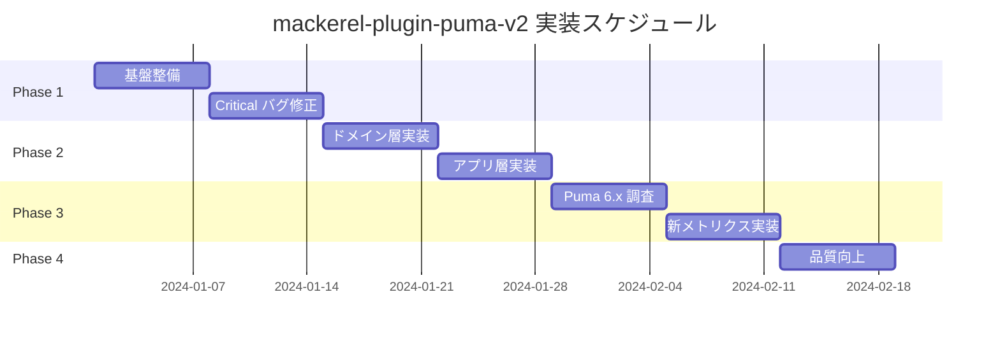

# mackerel-plugin-puma-v2 実装ロードマップ

## 概要

このドキュメントは、mackerel-plugin-puma-v2 の新規実装における詳細なロードマップです。ゼロから構築する新しいプラグインとして、最新の Puma 6.6.1 に完全対応した設計で実装します。

## タイムライン



## Phase 1: 基盤整備とCriticalバグ修正

### Week 1: プロジェクト基盤整備

#### 1.1 Go Modules 導入

```bash
# go.mod の作成
go mod init github.com/srockstyle/mackerel-plugin-puma-v2
go mod tidy
```

**go.mod 例:**
```go
module github.com/srockstyle/mackerel-plugin-puma-v2

go 1.21

require (
    github.com/mackerelio/go-mackerel-plugin v0.1.4
    github.com/stretchr/testify v1.8.4
)
```

#### 1.2 プロジェクト構造の再編成

```
mackerel-plugin-puma-v2/
├── cmd/
│   └── mackerel-plugin-puma-v2/
│       └── main.go
├── internal/
│   ├── domain/
│   │   ├── metric.go
│   │   └── definitions.go
│   ├── application/
│   │   ├── collector.go
│   │   └── config.go
│   ├── infrastructure/
│   │   ├── puma_client.go
│   │   ├── http_client.go
│   │   └── parsers/
│   │       ├── v6.go
│   │       ├── v5.go
│   │       └── v4.go
│   └── presentation/
│       └── mackerel_formatter.go
├── pkg/
│   └── puma/
│       └── stats.go
├── test/
│   ├── integration/
│   └── e2e/
├── docs/
├── scripts/
├── .github/
│   └── workflows/
│       ├── test.yml
│       └── release.yml
├── go.mod
├── go.sum
├── Makefile
└── README.md
```

#### 1.3 CI/CD パイプライン設定

**.github/workflows/test.yml:**
```yaml
name: Test

on:
  push:
    branches: [ main ]
  pull_request:
    branches: [ main ]

jobs:
  test:
    runs-on: ubuntu-latest
    strategy:
      matrix:
        go-version: [1.20, 1.21]

    steps:
    - uses: actions/checkout@v3

    - name: Set up Go
      uses: actions/setup-go@v4
      with:
        go-version: ${{ matrix.go-version }}

    - name: Test
      run: |
        go test -v ./...
        go test -race -coverprofile=coverage.txt -covermode=atomic ./...

    - name: Upload coverage
      uses: codecov/codecov-action@v3
      with:
        file: ./coverage.txt
```

### Week 2: Critical バグ修正

#### 2.1 Unix Socket 通信の修正

**修正前の問題のあるコード:**
```go
buffer := make([]byte, 4096)
n, err := conn.Read(buffer)
```

**修正後のコード:**
```go
// internal/infrastructure/http_client.go
package infrastructure

import (
    "bufio"
    "fmt"
    "io"
    "net"
    "net/http"
    "time"
)

type UnixSocketClient struct {
    socketPath string
    timeout    time.Duration
}

func NewUnixSocketClient(socketPath string, timeout time.Duration) *UnixSocketClient {
    return &UnixSocketClient{
        socketPath: socketPath,
        timeout:    timeout,
    }
}

func (c *UnixSocketClient) Get(path string) ([]byte, error) {
    conn, err := net.Dial("unix", c.socketPath)
    if err != nil {
        return nil, fmt.Errorf("connecting to unix socket %s: %w", c.socketPath, err)
    }
    defer conn.Close()

    // タイムアウト設定
    if err := conn.SetDeadline(time.Now().Add(c.timeout)); err != nil {
        return nil, fmt.Errorf("setting connection deadline: %w", err)
    }

    // HTTP リクエスト送信
    request := fmt.Sprintf("GET %s HTTP/1.0\r\nHost: localhost\r\n\r\n", path)
    if _, err := conn.Write([]byte(request)); err != nil {
        return nil, fmt.Errorf("sending request: %w", err)
    }

    // レスポンス読み取り
    reader := bufio.NewReader(conn)

    // HTTP レスポンスのパース
    resp, err := http.ReadResponse(reader, nil)
    if err != nil {
        return nil, fmt.Errorf("reading response: %w", err)
    }
    defer resp.Body.Close()

    if resp.StatusCode != http.StatusOK {
        return nil, fmt.Errorf("unexpected status code: %d", resp.StatusCode)
    }

    body, err := io.ReadAll(resp.Body)
    if err != nil {
        return nil, fmt.Errorf("reading response body: %w", err)
    }

    return body, nil
}
```

#### 2.2 エラーハンドリングの改善

**internal/application/collector.go:**
```go
package application

import (
    "context"
    "fmt"
    "log"
    "time"

    "github.com/srockstyle/mackerel-plugin-puma-v2/internal/domain"
)

type MetricsCollector struct {
    client        PumaClient
    parser        StatsParser
    retryCount    int
    retryInterval time.Duration
    logger        *log.Logger
}

func (c *MetricsCollector) Collect(ctx context.Context) (*domain.MetricCollection, error) {
    var lastErr error

    for i := 0; i <= c.retryCount; i++ {
        if i > 0 {
            c.logger.Printf("Retry attempt %d/%d after %v", i, c.retryCount, c.retryInterval)
            select {
            case <-ctx.Done():
                return nil, ctx.Err()
            case <-time.After(c.retryInterval):
            }
        }

        stats, err := c.collectWithTimeout(ctx)
        if err == nil {
            return stats, nil
        }

        lastErr = err
        c.logger.Printf("Collection failed: %v", err)
    }

    return nil, fmt.Errorf("failed after %d attempts: %w", c.retryCount+1, lastErr)
}

func (c *MetricsCollector) collectWithTimeout(ctx context.Context) (*domain.MetricCollection, error) {
    ctx, cancel := context.WithTimeout(ctx, 10*time.Second)
    defer cancel()

    statsChan := make(chan *domain.MetricCollection, 1)
    errChan := make(chan error, 1)

    go func() {
        stats, err := c.fetchAndParse()
        if err != nil {
            errChan <- err
            return
        }
        statsChan <- stats
    }()

    select {
    case <-ctx.Done():
        return nil, fmt.Errorf("collection timeout: %w", ctx.Err())
    case err := <-errChan:
        return nil, err
    case stats := <-statsChan:
        return stats, nil
    }
}
```

## Phase 2: アーキテクチャ改善

### Week 3: ドメイン層とインフラ層

#### 3.1 ドメインモデルの定義

**internal/domain/metric.go:**
```go
package domain

import (
    "fmt"
    "time"
)

// MetricType represents the type of metric
type MetricType string

const (
    MetricTypeGauge   MetricType = "gauge"
    MetricTypeCounter MetricType = "counter"
)

// Metric represents a single metric data point
type Metric struct {
    Name      string
    Value     float64
    Type      MetricType
    Unit      string
    Timestamp time.Time
    Labels    map[string]string
}

// Validate checks if the metric is valid
func (m *Metric) Validate() error {
    if m.Name == "" {
        return fmt.Errorf("metric name cannot be empty")
    }
    if m.Type != MetricTypeGauge && m.Type != MetricTypeCounter {
        return fmt.Errorf("invalid metric type: %s", m.Type)
    }
    return nil
}

// MetricCollection holds multiple metrics
type MetricCollection struct {
    metrics []Metric
}

// NewMetricCollection creates a new metric collection
func NewMetricCollection() *MetricCollection {
    return &MetricCollection{
        metrics: make([]Metric, 0),
    }
}

// Add adds a metric to the collection
func (mc *MetricCollection) Add(metric Metric) error {
    if err := metric.Validate(); err != nil {
        return fmt.Errorf("invalid metric: %w", err)
    }
    mc.metrics = append(mc.metrics, metric)
    return nil
}

// All returns all metrics in the collection
func (mc *MetricCollection) All() []Metric {
    return mc.metrics
}

// Filter returns metrics matching the given predicate
func (mc *MetricCollection) Filter(predicate func(Metric) bool) []Metric {
    filtered := make([]Metric, 0)
    for _, m := range mc.metrics {
        if predicate(m) {
            filtered = append(filtered, m)
        }
    }
    return filtered
}
```

#### 3.2 インフラストラクチャ層の実装

**internal/infrastructure/puma_client.go:**
```go
package infrastructure

import (
    "context"
    "encoding/json"
    "fmt"
    "net/http"
    "time"
)

// PumaStats represents the raw stats from Puma
type PumaStats struct {
    Workers       int                    `json:"workers"`
    Phase         int                    `json:"phase"`
    BootedWorkers int                    `json:"booted_workers"`
    OldWorkers    int                    `json:"old_workers"`
    WorkerStatus  []WorkerStatus         `json:"worker_status"`
    // Single mode fields
    Backlog      *int                   `json:"backlog,omitempty"`
    Running      *int                   `json:"running,omitempty"`
    PoolCapacity *int                   `json:"pool_capacity,omitempty"`
    MaxThreads   *int                   `json:"max_threads,omitempty"`
    // Puma 6.x fields
    RequestsCount *int64                `json:"requests_count,omitempty"`
    Uptime        *int                  `json:"uptime,omitempty"`
}

type WorkerStatus struct {
    PID          int        `json:"pid"`
    Index        int        `json:"index"`
    Phase        int        `json:"phase"`
    Booted       bool       `json:"booted"`
    LastCheckin  time.Time  `json:"last_checkin"`
    LastStatus   LastStatus `json:"last_status"`
}

type LastStatus struct {
    Backlog      int `json:"backlog"`
    Running      int `json:"running"`
    PoolCapacity int `json:"pool_capacity"`
    MaxThreads   int `json:"max_threads"`
}

type PumaClient struct {
    httpClient HTTPClient
    baseURL    string
}

func NewPumaClient(httpClient HTTPClient, baseURL string) *PumaClient {
    return &PumaClient{
        httpClient: httpClient,
        baseURL:    baseURL,
    }
}

func (c *PumaClient) GetStats(ctx context.Context) (*PumaStats, error) {
    url := fmt.Sprintf("%s/stats", c.baseURL)

    req, err := http.NewRequestWithContext(ctx, "GET", url, nil)
    if err != nil {
        return nil, fmt.Errorf("creating request: %w", err)
    }

    resp, err := c.httpClient.Do(req)
    if err != nil {
        return nil, fmt.Errorf("executing request: %w", err)
    }
    defer resp.Body.Close()

    if resp.StatusCode != http.StatusOK {
        return nil, fmt.Errorf("unexpected status code: %d", resp.StatusCode)
    }

    var stats PumaStats
    if err := json.NewDecoder(resp.Body).Decode(&stats); err != nil {
        return nil, fmt.Errorf("decoding response: %w", err)
    }

    return &stats, nil
}

// GetGCStats gets GC statistics (if available)
func (c *PumaClient) GetGCStats(ctx context.Context) (map[string]interface{}, error) {
    url := fmt.Sprintf("%s/gc-stats", c.baseURL)

    req, err := http.NewRequestWithContext(ctx, "GET", url, nil)
    if err != nil {
        return nil, fmt.Errorf("creating request: %w", err)
    }

    resp, err := c.httpClient.Do(req)
    if err != nil {
        return nil, fmt.Errorf("executing request: %w", err)
    }
    defer resp.Body.Close()

    // GC stats might not be available in newer versions
    if resp.StatusCode == http.StatusNotFound {
        return nil, nil
    }

    if resp.StatusCode != http.StatusOK {
        return nil, fmt.Errorf("unexpected status code: %d", resp.StatusCode)
    }

    var gcStats map[string]interface{}
    if err := json.NewDecoder(resp.Body).Decode(&gcStats); err != nil {
        return nil, fmt.Errorf("decoding response: %w", err)
    }

    return gcStats, nil
}
```

### Week 4: アプリケーション層とプレゼンテーション層

#### 4.1 アプリケーション層の実装

**internal/application/config.go:**
```go
package application

import (
    "fmt"
    "net/url"
    "time"
)

type Config struct {
    // Connection settings
    Host       string
    Port       string
    SocketPath string
    Scheme     string

    // Authentication
    Token string

    // Behavior settings
    SingleMode     bool
    WithGC         bool
    MetricPrefix   string

    // Performance settings
    Timeout       time.Duration
    RetryCount    int
    RetryInterval time.Duration
}

// DefaultConfig returns a config with sensible defaults
func DefaultConfig() *Config {
    return &Config{
        Host:          "127.0.0.1",
        Port:          "9293",
        Scheme:        "http",
        MetricPrefix:  "puma",
        Timeout:       10 * time.Second,
        RetryCount:    3,
        RetryInterval: 1 * time.Second,
    }
}

// Validate checks if the configuration is valid
func (c *Config) Validate() error {
    if c.SocketPath == "" {
        if c.Host == "" {
            return fmt.Errorf("either socket path or host must be specified")
        }
        if c.Port == "" {
            return fmt.Errorf("port must be specified when using host")
        }
        if c.Scheme != "http" && c.Scheme != "https" {
            return fmt.Errorf("scheme must be http or https, got %s", c.Scheme)
        }
    }

    if c.Timeout <= 0 {
        return fmt.Errorf("timeout must be positive")
    }

    if c.RetryCount < 0 {
        return fmt.Errorf("retry count must be non-negative")
    }

    return nil
}

// GetBaseURL returns the base URL for API requests
func (c *Config) GetBaseURL() string {
    if c.SocketPath != "" {
        return "http://localhost"
    }
    return fmt.Sprintf("%s://%s:%s", c.Scheme, c.Host, c.Port)
}
```

## Phase 3: Puma 6.x 対応

### Week 5: API 調査とバージョン検出

#### 5.1 バージョン検出機能

**internal/infrastructure/version_detector.go:**
```go
package infrastructure

import (
    "context"
    "regexp"
    "strings"
)

type VersionDetector struct {
    client PumaClient
}

func NewVersionDetector(client PumaClient) *VersionDetector {
    return &VersionDetector{client: client}
}

// DetectVersion attempts to detect the Puma version
func (d *VersionDetector) DetectVersion(ctx context.Context) (string, error) {
    // Try to get stats first
    stats, err := d.client.GetStats(ctx)
    if err != nil {
        return "", err
    }

    // Check for version-specific fields
    if stats.RequestsCount != nil {
        // Puma 6.x has requests_count field
        return "6.x", nil
    }

    if stats.WorkerStatus != nil && len(stats.WorkerStatus) > 0 {
        // Puma 5.x has detailed worker status
        return "5.x", nil
    }

    // Default to 4.x for older versions
    return "4.x", nil
}
```

#### 5.2 バージョン別パーサー

**internal/infrastructure/parsers/v6.go:**
```go
package parsers

import (
    "time"

    "github.com/srockstyle/mackerel-plugin-puma-v2/internal/domain"
    "github.com/srockstyle/mackerel-plugin-puma-v2/internal/infrastructure"
)

type V6Parser struct{}

func NewV6Parser() *V6Parser {
    return &V6Parser{}
}

func (p *V6Parser) Parse(stats *infrastructure.PumaStats) (*domain.MetricCollection, error) {
    collection := domain.NewMetricCollection()
    timestamp := time.Now()

    // Worker metrics
    collection.Add(domain.Metric{
        Name:      "workers",
        Value:     float64(stats.Workers),
        Type:      domain.MetricTypeGauge,
        Unit:      "count",
        Timestamp: timestamp,
    })

    collection.Add(domain.Metric{
        Name:      "booted_workers",
        Value:     float64(stats.BootedWorkers),
        Type:      domain.MetricTypeGauge,
        Unit:      "count",
        Timestamp: timestamp,
    })

    collection.Add(domain.Metric{
        Name:      "old_workers",
        Value:     float64(stats.OldWorkers),
        Type:      domain.MetricTypeGauge,
        Unit:      "count",
        Timestamp: timestamp,
    })

    // Phase
    collection.Add(domain.Metric{
        Name:      "phase",
        Value:     float64(stats.Phase),
        Type:      domain.MetricTypeGauge,
        Unit:      "phase",
        Timestamp: timestamp,
    })

    // New in Puma 6.x: Request count
    if stats.RequestsCount != nil {
        collection.Add(domain.Metric{
            Name:      "requests_count",
            Value:     float64(*stats.RequestsCount),
            Type:      domain.MetricTypeCounter,
            Unit:      "requests",
            Timestamp: timestamp,
        })
    }

    // New in Puma 6.x: Uptime
    if stats.Uptime != nil {
        collection.Add(domain.Metric{
            Name:      "uptime",
            Value:     float64(*stats.Uptime),
            Type:      domain.MetricTypeGauge,
            Unit:      "seconds",
            Timestamp: timestamp,
        })
    }

    // Process worker status
    for _, worker := range stats.WorkerStatus {
        labels := map[string]string{
            "worker_index": fmt.Sprintf("%d", worker.Index),
            "worker_pid":   fmt.Sprintf("%d", worker.PID),
        }

        collection.Add(domain.Metric{
            Name:      "worker_backlog",
            Value:     float64(worker.LastStatus.Backlog),
            Type:      domain.MetricTypeGauge,
            Unit:      "requests",
            Timestamp: timestamp,
            Labels:    labels,
        })

        collection.Add(domain.Metric{
            Name:      "worker_running",
            Value:     float64(worker.LastStatus.Running),
            Type:      domain.MetricTypeGauge,
            Unit:      "threads",
            Timestamp: timestamp,
            Labels:    labels,
        })

        collection.Add(domain.Metric{
            Name:      "worker_pool_capacity",
            Value:     float64(worker.LastStatus.PoolCapacity),
            Type:      domain.MetricTypeGauge,
            Unit:      "threads",
            Timestamp: timestamp,
            Labels:    labels,
        })

        // Calculate thread utilization
        if worker.LastStatus.PoolCapacity > 0 {
            utilization := float64(worker.LastStatus.Running) / float64(worker.LastStatus.PoolCapacity) * 100
            collection.Add(domain.Metric{
                Name:      "worker_thread_utilization",
                Value:     utilization,
                Type:      domain.MetricTypeGauge,
                Unit:      "percent",
                Timestamp: timestamp,
                Labels:    labels,
            })
        }
    }

    // Single mode metrics
    if stats.Backlog != nil {
        collection.Add(domain.Metric{
            Name:      "backlog",
            Value:     float64(*stats.Backlog),
            Type:      domain.MetricTypeGauge,
            Unit:      "requests",
            Timestamp: timestamp,
        })
    }

    if stats.Running != nil {
        collection.Add(domain.Metric{
            Name:      "running",
            Value:     float64(*stats.Running),
            Type:      domain.MetricTypeGauge,
            Unit:      "threads",
            Timestamp: timestamp,
        })
    }

    if stats.PoolCapacity != nil && stats.MaxThreads != nil {
        collection.Add(domain.Metric{
            Name:      "pool_capacity",
            Value:     float64(*stats.PoolCapacity),
            Type:      domain.MetricTypeGauge,
            Unit:      "threads",
            Timestamp: timestamp,
        })

        collection.Add(domain.Metric{
            Name:      "max_threads",
            Value:     float64(*stats.MaxThreads),
            Type:      domain.MetricTypeGauge,
            Unit:      "threads",
            Timestamp: timestamp,
        })
    }

    return collection, nil
}
```

### Week 6: 新メトリクスの実装

#### 6.1 拡張メトリクス収集

**internal/application/extended_collector.go:**
```go
package application

import (
    "context"
    "os"
    "runtime"
    "syscall"

    "github.com/srockstyle/mackerel-plugin-puma-v2/internal/domain"
)

type ExtendedMetricsCollector struct {
    baseCollector *MetricsCollector
}

func NewExtendedMetricsCollector(base *MetricsCollector) *ExtendedMetricsCollector {
    return &ExtendedMetricsCollector{
        baseCollector: base,
    }
}

func (c *ExtendedMetricsCollector) CollectWithSystemMetrics(ctx context.Context) (*domain.MetricCollection, error) {
    // Get base metrics
    collection, err := c.baseCollector.Collect(ctx)
    if err != nil {
        return nil, err
    }

    // Add system metrics
    c.addMemoryMetrics(collection)
    c.addFileDescriptorMetrics(collection)

    return collection, nil
}

func (c *ExtendedMetricsCollector) addMemoryMetrics(collection *domain.MetricCollection) {
    var m runtime.MemStats
    runtime.ReadMemStats(&m)

    collection.Add(domain.Metric{
        Name:  "go_memory_alloc",
        Value: float64(m.Alloc),
        Type:  domain.MetricTypeGauge,
        Unit:  "bytes",
    })

    collection.Add(domain.Metric{
        Name:  "go_memory_sys",
        Value: float64(m.Sys),
        Type:  domain.MetricTypeGauge,
        Unit:  "bytes",
    })

    collection.Add(domain.Metric{
        Name:  "go_goroutines",
        Value: float64(runtime.NumGoroutine()),
        Type:  domain.MetricTypeGauge,
        Unit:  "count",
    })
}

func (c *ExtendedMetricsCollector) addFileDescriptorMetrics(collection *domain.MetricCollection) {
    var rlimit syscall.Rlimit
    if err := syscall.Getrlimit(syscall.RLIMIT_NOFILE, &rlimit); err == nil {
        collection.Add(domain.Metric{
            Name:  "file_descriptor_limit",
            Value: float64(rlimit.Cur),
            Type:  domain.MetricTypeGauge,
            Unit:  "count",
        })
    }
}
```

## Phase 4: 品質向上

### Week 7: テストと最適化

#### 7.1 統合テスト

**test/integration/puma_integration_test.go:**
```go
package integration

import (
    "context"
    "encoding/json"
    "net/http"
    "net/http/httptest"
    "testing"
    "time"

    "github.com/stretchr/testify/assert"
    "github.com/stretchr/testify/require"

    "github.com/srockstyle/mackerel-plugin-puma-v2/internal/application"
    "github.com/srockstyle/mackerel-plugin-puma-v2/internal/infrastructure"
)

func TestPumaV6Integration(t *testing.T) {
    // Create mock Puma server
    server := httptest.NewServer(http.HandlerFunc(func(w http.ResponseWriter, r *http.Request) {
        switch r.URL.Path {
        case "/stats":
            stats := infrastructure.PumaStats{
                Workers:       4,
                Phase:         0,
                BootedWorkers: 4,
                OldWorkers:    0,
                RequestsCount: intPtr(12345),
                Uptime:        intPtr(3600),
                WorkerStatus: []infrastructure.WorkerStatus{
                    {
                        PID:    1234,
                        Index:  0,
                        Phase:  0,
                        Booted: true,
                        LastStatus: infrastructure.LastStatus{
                            Backlog:      0,
                            Running:      5,
                            PoolCapacity: 16,
                            MaxThreads:   16,
                        },
                    },
                },
            }
            json.NewEncoder(w).Encode(stats)
        default:
            w.WriteHeader(http.StatusNotFound)
        }
    }))
    defer server.Close()

    // Configure collector
    config := application.DefaultConfig()
    config.Host = server.URL
    config.Port = ""
    config.Scheme = "http"

    httpClient := &http.Client{Timeout: 5 * time.Second}
    pumaClient := infrastructure.NewPumaClient(httpClient, server.URL)
    parser := infrastructure.NewV6Parser()

    collector := application.NewMetricsCollector(pumaClient, parser, config)

    // Collect metrics
    ctx := context.Background()
    metrics, err := collector.Collect(ctx)
    require.NoError(t, err)

    // Verify metrics
    allMetrics := metrics.All()
    assert.NotEmpty(t, allMetrics)

    // Check specific metrics
    workerMetric := findMetric(allMetrics, "workers")
    require.NotNil(t, workerMetric)
    assert.Equal(t, float64(4), workerMetric.Value)

    requestsMetric := findMetric(allMetrics, "requests_count")
    require.NotNil(t, requestsMetric)
    assert.Equal(t, float64(12345), requestsMetric.Value)
}

func findMetric(metrics []domain.Metric, name string) *domain.Metric {
    for _, m := range metrics {
        if m.Name == name {
            return &m
        }
    }
    return nil
}

func intPtr(i int) *int {
    return &i
}

func int64Ptr(i int64) *int64 {
    return &i
}
```

#### 7.2 ベンチマークテスト

**test/benchmark/collector_bench_test.go:**
```go
package benchmark

import (
    "context"
    "testing"

    "github.com/srockstyle/mackerel-plugin-puma-v2/internal/application"
    "github.com/srockstyle/mackerel-plugin-puma-v2/internal/infrastructure"
)

func BenchmarkMetricsCollection(b *testing.B) {
    // Setup
    config := application.DefaultConfig()
    client := createMockClient()
    parser := infrastructure.NewV6Parser()
    collector := application.NewMetricsCollector(client, parser, config)

    ctx := context.Background()

    b.ResetTimer()

    for i := 0; i < b.N; i++ {
        _, err := collector.Collect(ctx)
        if err != nil {
            b.Fatal(err)
        }
    }
}

func BenchmarkParseStats(b *testing.B) {
    parser := infrastructure.NewV6Parser()
    stats := createSampleStats()

    b.ResetTimer()

    for i := 0; i < b.N; i++ {
        _, err := parser.Parse(stats)
        if err != nil {
            b.Fatal(err)
        }
    }
}
```

## チェックリスト

### Phase 1 チェックリスト
- [ ] go.mod 作成
- [ ] プロジェクト構造の再編成
- [ ] CI/CD パイプライン設定
- [ ] Unix Socket 通信の修正
- [ ] エラーハンドリングの改善
- [ ] リソースリークの修正

### Phase 2 チェックリスト
- [ ] ドメインモデルの定義
- [ ] インフラストラクチャ層の実装
- [ ] アプリケーション層の実装
- [ ] プレゼンテーション層の実装
- [ ] 依存性注入の実装

### Phase 3 チェックリスト
- [ ] Puma 6.x API 調査
- [ ] バージョン検出機能
- [ ] バージョン別パーサー実装
- [ ] 新メトリクスの追加
- [ ] 後方互換性の確保

### Phase 4 チェックリスト
- [ ] 単体テスト（カバレッジ 80%+）
- [ ] 統合テスト
- [ ] E2E テスト
- [ ] ベンチマークテスト
- [ ] ドキュメント更新
- [ ] リリース準備

## まとめ

このロードマップに従って実装を進めることで、段階的かつ確実に Puma 6.6.1 対応を完了できます。各フェーズでは以下を重視します：

1. **Phase 1**: 緊急性の高い問題の修正
2. **Phase 2**: 将来の拡張性を考慮した設計
3. **Phase 3**: 最新バージョンへの対応
4. **Phase 4**: 品質保証と持続可能性

特に重要なのは、各フェーズでテストを充実させ、継続的に品質を保証することです。